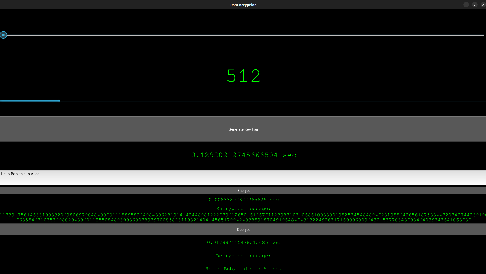

# Käyttöohje

1. Valitse liukusäätimellä generoitavan aivaimen koko bitteinä.
  - Avainparin koko on valittavissa väliltä `[512-4096]`.
2. Generoi avainpari painamalla `Generate Key Pair`-nappia.
  - Generointiin kuluva aika ilmestyy napin alapuolelle.
  - Suurten avainparien generoinnissa saattaa kulua useita kymmeniä sekunteja.
3. Syötä salattava viesti tekstikenttään.
  - Kentän oletus viestin voi korvata omalla.
4. Salaa viesti painamalla `Encrypt`-nappia.
  - Salauksen jälkeen alle ilmestyy:
    - Viestin salaukseen kulunut aika
    - Viesti salatussa muodossa
5. Pura viestin salaus painamalla `Decrypt`-nappia.
  - Purettua viestin salaus alle ilmestyy:
    - salauksen purkuun kulunut aika
    - purettu salaviesti