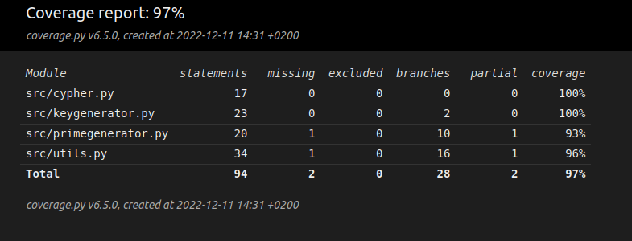

# Testausdokumentti

## Yksikkötestaus

Tässä projektissa on toteutettu automaatiotestit yksikkötestien tasolla hyödyntäen pythonin unittest kirjastoa. Testeissä otetaan huomioon kaikki moduulit lukuunottamatta pääohjelmaa `main`. Lisäksi moduulissa `primegenerator` jää tarkistamatta haara, jossa funktio luo alkulukuparin, mutta näiden lukujen samanarvoisuutta ei kyetä testien avulla vertaamaan. Tämä johtuu siitä, että alkulukujen generointi pohjautuu satunnaisuuteen.

## Testikattavuus

Testikattavuus on 98%.



## Testien suorittaminen

Ohjelman testit voi suorittaa komennola
```
poetry run invoke test
```


